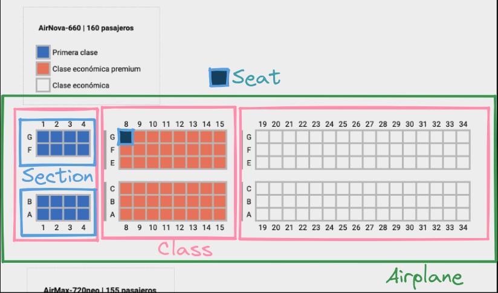

<div align="center">
    <a href="https://www.bsale.cl/">
        
    </a>
</div>

<h1 align="center"> Challenge Bsale Andes Airlines</h1>

<!-- TABLE OF CONTENTS -->

## Tabla de contenidos

-   [Tabla de contenidos](#tabla-de-contenidos)
-   [Descripcion del proyecto y uso](#descripcion-del-proyecto-y-uso)
-   [Imagen de condiciones al implementar el check-in](#imagen-de-condiciones-al-implementar-el-check-in)
-   [Como llegué a la solución](#como-llegué-a-la-solución)
-   [Clases Implementadas:](#clases-implementadas)
-   [Como ejecutar el proyecto localmente con Docker](#como-ejecutar-el-proyecto-localmente-con-docker)
-   [Contacto](#contacto)

---

## Descripcion del proyecto y uso

El proyecto consiste en implementar para una aerolinea un sistema de CHECK-IN, en el cual se busca asignar y registrar de forma automática, los pasajeros de cada uno de los vuelos.
Se implementó una simple REST-API, hecha con `Javascript` con el framework `Express`, en donde se consume información de una base de datos `MySQL`, con el ORM `Prisma` para obtener toda la información sobre los aviones, los vuelos programados, cada uno de sus pasajeros y demás. En resumen, se debe registrar formalmente aquellos pasajeros que ya poseen `tarjeta de embarque`, y asignarle un asiento a aquellos que compraron su pasaje. Realizar esta asignación, tiene sus condiciones, que lo explica la siguiente captura de pantalla.

## Imagen de condiciones al implementar el check-in


## Como llegué a la solución

El desafío principal está en la asignación de asientos, sobre todo en donde las compras, contenian múltiples `boarding passes` y/o contenian menores de edad. Decidí dividir el problema en pequeñas partes, para poder abordarlo de la mejor manera. Es por eso, que prototipe el avión, con clases de Javascript. El núcleo de la solución, se encuentra en estas clases, las cuales tienen sus respectivas propiedades y sus métodos, los cuales explico a continuación:



## Clases Implementadas:

-   Clase `AIRPLANE`:

En esta clase, recibo los `boardingPass` en crudo desde la base de datos y el id del avión. Creo las 3 clases y le asigno a cada una de ellas, los pasajes que le corresponden. Al finalizar todo el procesamiento de datos (de las otras clases), contiene un método en que captura la respuesta final, con todos los pasajeros procesados correctamente, para la respuesta del endpoint.

-   Clase `CLASS`:

En esta instancia, cada clase tiene sus propios pasajes. Esta clase las sigue procesando y divide los `boardingPasses` entre los que tienen asiento asignado y los que no. También los agrupa por compra `purchaseId` y ordena de tal forma, que se procesen primero, dandole prioridad a aquellas que poseen mayor cantidad de pasajes comprados.
Creo que la clave de la asignación, proviene de este agrupamiento, ya que al principio el avión tendrá más asientos y al procesar primero estos, es mucho mas fácil encontrar asientos disponibles y cumplir las condiciones impuestas en el desafío. Esta es la clase que mas métodos y lógica tiene de todas.

-   Clase `SECTION`:

Cada una de estas clases, contiene según el avión, una sectorización. El avion con id 1, tiene 2 sectores por cada clase, mientras que el avion con id 2 tiene 3 sectores. Esta clase contiene la propiedad `seats` en donde estará la matriz de asientos. Contiene métodos para obtener, cuantos asientos tiene disponible, obtener filas con 2 asientos disponibles para cumplir la condicion del menor de edad y para la búsqueda del asiento disponible.

-   Clase `SEAT`:

Por último, el asiento, en donde tendrá las coordenadas en donde se encuentra y la información del pasajero

> Dato de color: Decidí, hacer comentarios breves en forma de documentación, por encima de los métodos de las clases y no implementar por ejemplo JSDoc, solo por preferencia y gusto, ya que esta útlima se me hace muy verboso.

## Como ejecutar el proyecto localmente con Docker

1. **Clonar el repositorio**

```sh
git clone https://github.com/luem2/challenge-bsale.git
```

2. **Ejecutar el siguiente comando en la raíz del proyecto, para construir y levantar los servicios:**

```sh
docker compose up -d --build
```

3. **Ejecutar el endpoint**:

-   Base URL: [http://localhost:3000/](http://localhost:3000/) </br>
-   Endpoint: `/flights/:id/passengers`
-   Ejemplo: http://localhost:3000/flights/1/passengers

## Contacto

-   Linkedin: [https://linkedin.com/in/lucianopinol](https://linkedin.com/in/lucianopinol)
-   Telegram: [@Luem02](https://t.me/luem02)
-   Email: lucianoepinol@gmail.com
